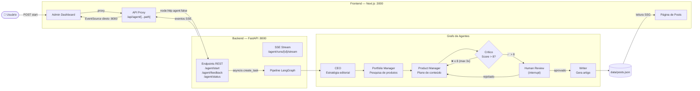
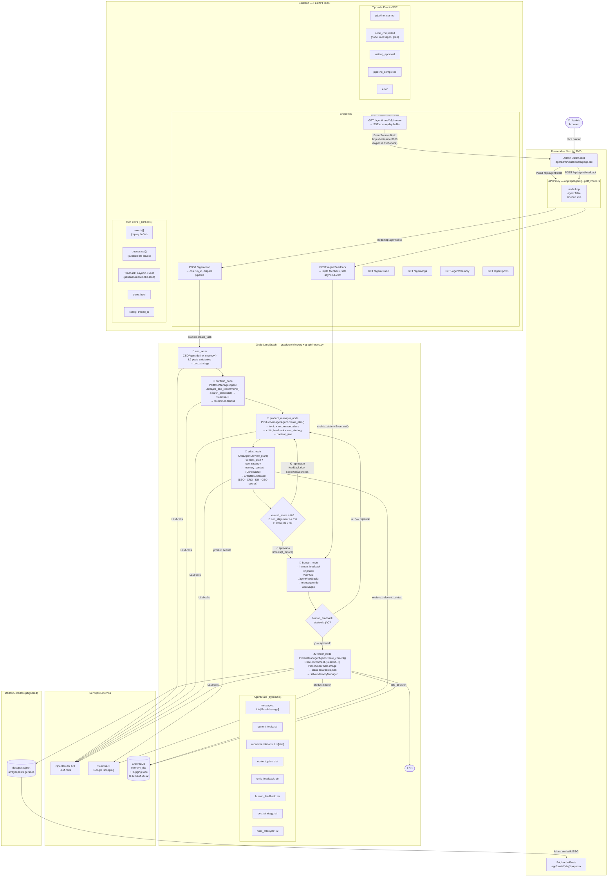

# Diagramas de Arquitetura

> Gerado em: 2026-03-14
> Versão atual do pipeline: SSE + `graph.astream()` + `asyncio.Event` para human-in-the-loop
> Critic: `with_structured_output(CriticResult)` + sub-scores por dimensão (SEO · CRO · Diferenciação · CEO)

---

## Diagrama Simplificado

Visão macro do fluxo de dados entre as camadas.

---

## Diagrama Completo

Detalhe de cada componente, estado do grafo, endpoints e tipos de evento SSE.

---

## Como manter atualizado

Toda vez que o fluxo do grafo mudar (novos nós, novas arestas, nova lógica de roteamento), edite este arquivo:

1. **Nó novo** → adicione em ambos os diagramas
2. **Threshold do crítico mudou** → atualize `score > 8.0` e o label da aresta `ScoreCheck`
3. **Novo tipo de evento SSE** → adicione em `SSEEvents` no diagrama completo
4. **Nova integração externa** → adicione em `Ext`

O diagrama simplificado serve para onboarding rápido; o completo é a referência técnica.
